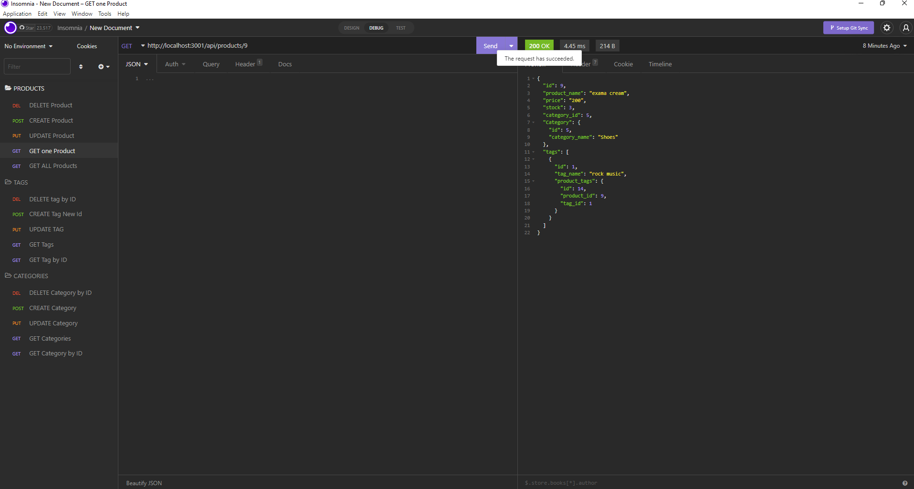

# Object-Relational-Mapping
*[description](#discription)
*[Installation](#install)
*[Usage](#usage)
*[visuals](#visuals)
*[License](#license)
*[Contributing](#Contributing)
*[Questions](#questions)
 
  ## description:
  this app allows you to update, get, create and delete things inside each route in your api
  ## Installation:
  first run 'npm i' then run 'npm run db:sync' from there all you need to do is seed the information by running the command 'npm run seed' and to run the server it is 'npm run watch'
  also you will need to take the EXAMPLE out of the .env file.
  ## visuals:

  ## Usage:
  this allows you to make your own api and pull from it as you need and allows you to edit however you want
  ## License:
  N/A
  ## Contributing:
  N/A
  ## Questions:
  *gfinnie01
  *grantfinnie0@gmail.com
